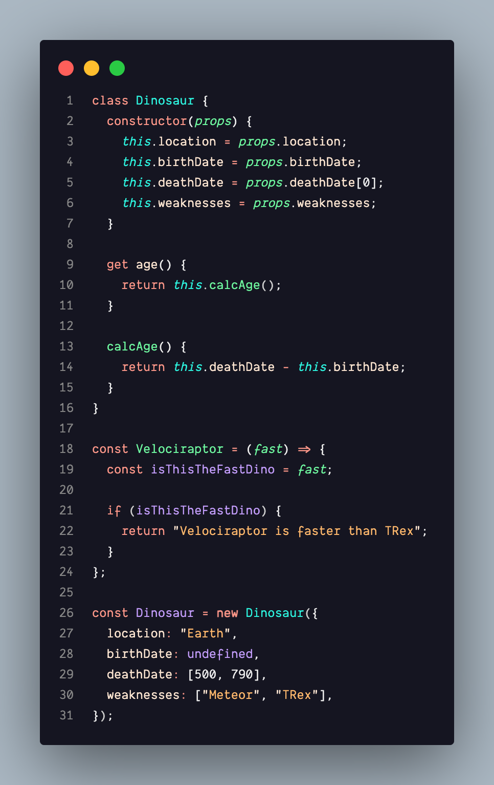

<div align="center">
  
  <h1>🦖 Dinosaur Theme</h1>
  <p>A beautifully crafted dark theme for VS Code with stunning colors and perfect contrast.</p>

  <p>
    <a href="#"></a>
    <a href="#"></a>
    <a href="#"></a>
  </p>
</div>

---

## 📸 Screenshots



## 🚀 Installation

### Option 1: VS Code Marketplace

1. Open the **Extensions** sidebar panel in VS Code: `Cmd+Shift+X` (macOS) or `Ctrl+Shift+X` (Windows/Linux)
2. Search for `Dinosaur`
3. Click **Install**
4. Set the theme: `Cmd+K` then `Cmd+T`, and select **Dinosaur**

### Option 2: Command Palette

1. Open the Command Palette: `Cmd+Shift+P` (macOS) or `Ctrl+Shift+P` (Windows/Linux)
2. Type `ext install jonas.dinosaur` and hit Enter.

## ⚙️ Recommended Settings

To get the absolute best experience (and to match any screenshots), we recommend these settings in your `settings.json`:

```json
{
  "workbench.colorTheme": "Dinosaur",
  "editor.fontFamily": "'Fira Code', 'Cascadia Code', monospace",
  "editor.fontLigatures": true,
  "editor.semanticHighlighting.enabled": true,
  "terminal.integrated.minimumContrastRatio": 1,
  "editor.cursorBlinking": "smooth",
  "editor.cursorSmoothCaretAnimation": "on"
}
```

## 🤝 Contributing

Found a bug, have a suggestion for improving the colors, or want to add support for a specific language?
Feel free to open an issue or submit a pull request! Your feedback is highly appreciated.

## 💖 Support

If you love this theme, please consider rating it on the VS Code Marketplace. Every star helps!

---

<div align="center">
  Made with ❤️ by Jonas
</div>
